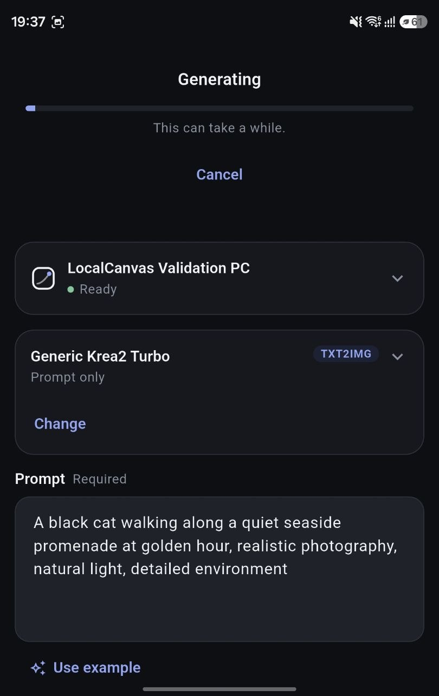
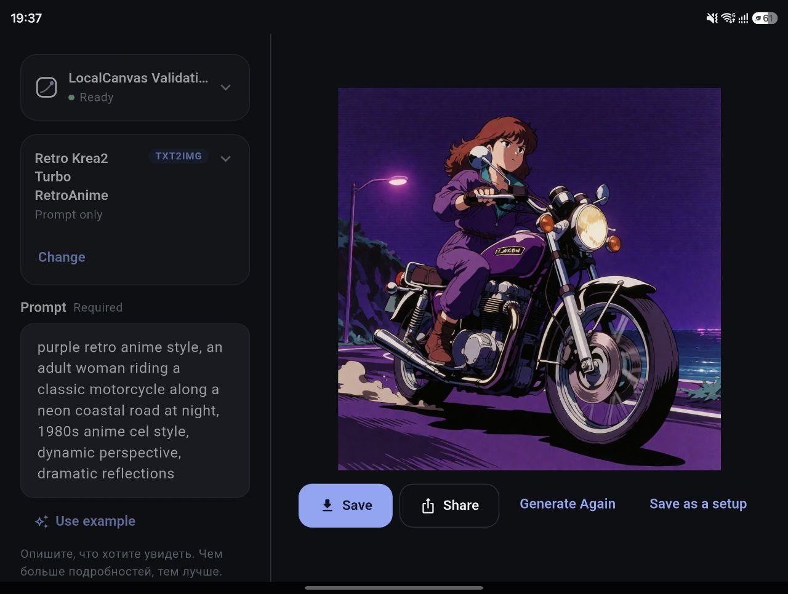
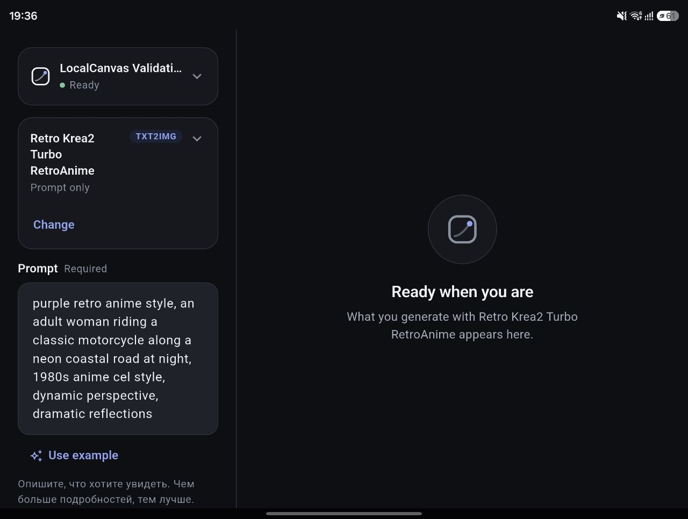

# LocalCanvas

**English** · [Русский](README.ru.md) · [日本語](README.ja.md)

**ComfyUI for building workflows. LocalCanvas for using them.**

LocalCanvas is an Android app for the ComfyUI workflows you already have. Pick a
workflow on your phone, type a prompt, add a picture or clip if the workflow
takes one (see [Known limitations](#known-limitations)), and press Generate. You
never see a node graph.

    Android app
        │  your Wi-Fi / LAN
        ▼
    LocalCanvas Gateway    ← the only thing on your network
        │  localhost
        ▼
    ComfyUI  →  GPU

- **Local-first.** Everything runs on your PC and your own network.
- **Works with your existing ComfyUI.** Nothing is installed into it.
- **An Android front end** that shows each workflow as a simple form.
- **Workflow import and sync** from your ComfyUI workflow folder.
- **No LocalCanvas cloud and no account.**

**What it is not** — deliberately, and for good: no accounts, login or
authentication; no cloud sync, remote access over the Internet or cloud
generation; no plugin marketplace or SDK; no workflow or node-graph editor; no
gateway that guesses a workflow's inputs at run time; no AI prompt enhancer or
embedded LLM; no database-backed history or server-side media library; no
multi-user support; no Kubernetes; no iOS app and no web front end.

## Screenshots

| On a phone | Unfolded |
| --- | --- |
|  |  |



## Requirements

- **Windows 10 or 11.**
- **PowerShell 7 or newer** (`pwsh`). Windows PowerShell 5.1 is not supported.
  Install it with `winget install --id Microsoft.PowerShell`.
- **Python 3.10 – 3.13, already installed** (from <https://www.python.org/downloads/>).
  Setup picks it and builds LocalCanvas's own environment from it.
- **ComfyUI, already working.** No ComfyUI yet? The optional
  [Minimal bootstrap](docs/user-guide.md#2-getting-comfyui) installs one — it
  downloads no models and builds no Python environment.
- **Google Chrome or Microsoft Edge**, to convert workflows saved with ComfyUI's
  **Save**.
- **An Android phone** (Android 7.0 or newer) on the same network.
- **git**, to clone this repository.
- Only if you build the app yourself: Flutter and the Android SDK
  (see [Android app](#android-app)).

## Quick start

In a PowerShell 7 window on the PC that runs ComfyUI:

```powershell
git clone https://github.com/shinKatana0/LocalCanvas.git LocalCanvas
cd LocalCanvas
pwsh .\scripts\setup.ps1
pwsh .\scripts\start.ps1
```

- Setup asks two short questions — do you start ComfyUI yourself, and where is
  your ComfyUI folder (the one with `main.py`, or the portable build's folder) —
  and writes the configuration for you. You edit no YAML. (A third question
  comes only if it cannot find your workflow folder.) The
  [user guide](docs/user-guide.md#3-install-and-start-localcanvas) explains both.
- Have ComfyUI running before `start.ps1` (unless you chose to let LocalCanvas
  start it).
- The first start finds your workflows and offers to import them.
- It ends by printing a QR code for the phone.

One more step: install the app on your phone — see [Android app](#android-app).

## Daily use

```powershell
pwsh .\scripts\start.ps1
```

This is the daily command. Keep its window open while you use the phone;
closing it stops LocalCanvas too.

On every start it checks your ComfyUI workflow folder. The check only reads your
files — it converts nothing and writes nothing.

- **Nothing changed** — `Workflows: unchanged - nothing new and nothing edited`,
  and LocalCanvas starts.
- **Something is new or changed** — it asks `Sync workflows now? [Y/n]`.
  Enter means yes.
- It never syncs on its own, and a session nobody can answer (a scheduled task,
  a CI step, a pipe, a `-NonInteractive` shell) is never asked: it names the
  command and starts as it is.

`pwsh .\scripts\stop.ps1` stops what LocalCanvas started;
`pwsh .\scripts\status.ps1` shows what is running.

## Adding or changing workflows

1. Create or edit a workflow in ComfyUI and **Save** it (or **Export (API)** —
   both work).
2. If LocalCanvas is running, stop it: `pwsh .\scripts\stop.ps1`.
3. With ComfyUI running (unless you chose to let LocalCanvas start it), run
   `pwsh .\scripts\start.ps1`.
4. It reports `Workflows: 1 new` (or `changed`) and asks `Sync workflows now? [Y/n]`.
5. If the app was already open and the workflow is not listed, tap
   **Refresh the list** (↻) at the top of **Choose a workflow**.

Nothing watches the folder in the background: changes are picked up when you run
`start.ps1`, or when you sync yourself:

```powershell
pwsh .\scripts\sync-workflows.ps1 -DryRun    # show what would be imported; write nothing
pwsh .\scripts\sync-workflows.ps1            # import now
pwsh .\scripts\start.ps1 -SyncWorkflows      # sync whatever changed, without asking, and start
```

A workflow LocalCanvas cannot read with confidence is held as `NEEDS_REVIEW`,
never guessed — the [user guide](docs/user-guide.md#4-your-workflows) says what
to do about one.

## Android app

**Get the APK.** Where this repository publishes one, download it from its
**Releases** page. Or build it yourself with Flutter and the Android SDK, from
`app/`:

```powershell
flutter pub get
flutter build apk --release --split-per-abi
```

Most phones want the `arm64-v8a` APK. Android will ask you to allow installing
from the app you opened it with — this is a sideload, not a store install. The
APK is debug-signed (a test-signed build), so uninstall LocalCanvas before
installing one built elsewhere. Details: [user guide](docs/user-guide.md#5-installing-the-app).

**Connect.** Scan the QR code `start.ps1` printed, type the address
(`192.0.2.42`, `192.0.2.42:7801` or `http://192.0.2.42:7801` — use your PC's
own), or pick the PC from the list the app finds, where your router allows
discovery. More: [Connecting over Wi-Fi](docs/user-guide.md#6-connecting-over-wi-fi).

**Windows Firewall.** The first time `start.ps1` runs, Windows may ask whether to
allow it on the network: allow **Private networks** only. The gateway has no
login, so keep it on a trusted home network. If the phone cannot reach the PC,
the firewall is the usual reason.

## Privacy

No telemetry, no analytics, no crash reporting, no accounts, no cloud
generation. The app talks only to your gateway, and the gateway only to your
ComfyUI. This is a promise about LocalCanvas's own code, **not about third-party
ComfyUI custom nodes**, which can do whatever their authors wrote — see
[SECURITY.md](SECURITY.md).

## Known limitations

- The PC side is **Windows only**.
- The maintainer has tested pairing and generation by hand on one foldable
  phone over Wi-Fi against a real ComfyUI. Nothing automated covers that path.
- Uploading a picture or clip has not yet been confirmed working from a phone.
- Prompt translation, and discovery (mDNS) reaching a phone, have only been
  exercised against fakes.
- A workflow held as `NEEDS_REVIEW` needs a person to decide what to expose.

More on what has been tested: [user guide](docs/user-guide.md#1-before-you-start).
Something not working? Run `pwsh .\scripts\doctor.ps1`, then see
[When something is wrong](docs/user-guide.md#13-when-something-is-wrong).

## More

- [User guide](docs/user-guide.md) — the full manual
  ([Русский](docs/user-guide.ru.md), [日本語](docs/user-guide.ja.md)).
- [CONTRIBUTING.md](CONTRIBUTING.md) — running the tests.
- [SECURITY.md](SECURITY.md) — the security model and reporting a problem.
- [CHANGELOG.md](CHANGELOG.md) — what changed.
- [LICENSE](LICENSE) — MIT.
