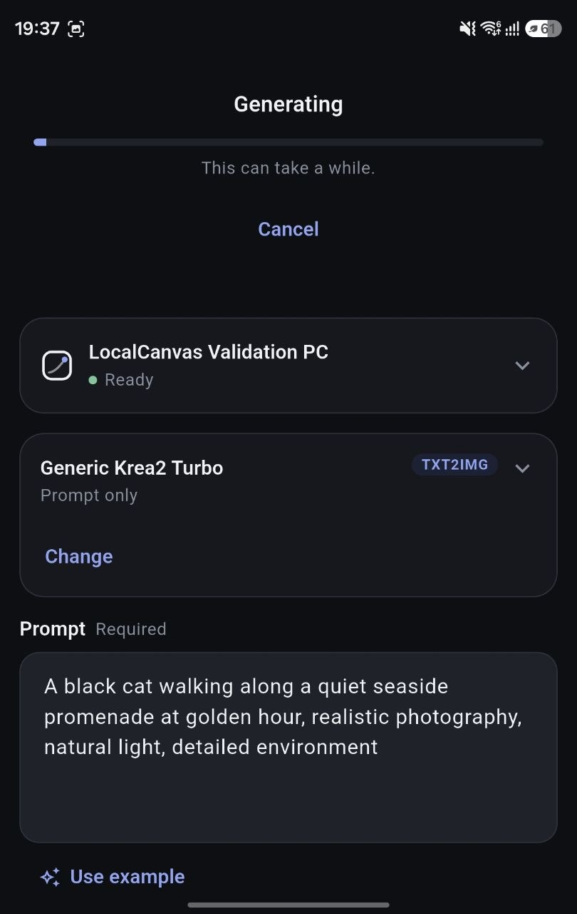
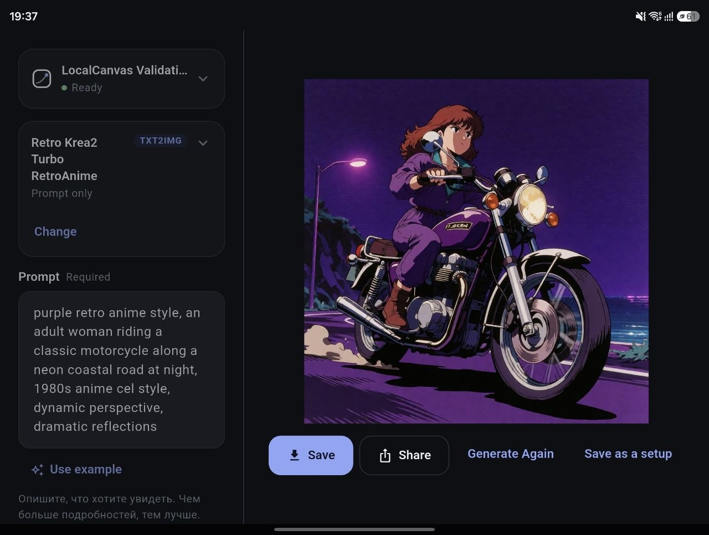
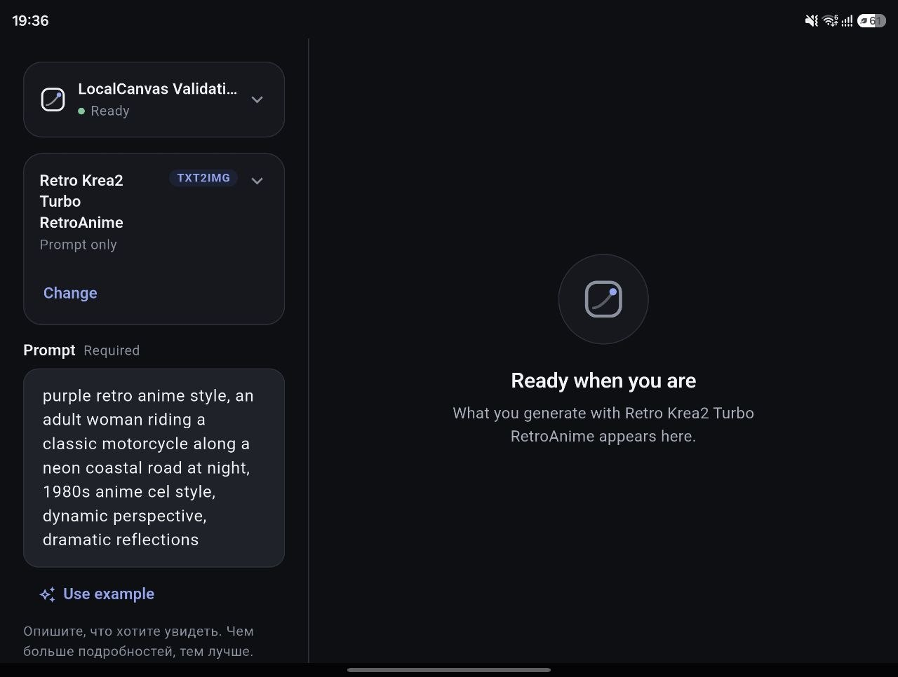

# LocalCanvas

[English](README.md) · **Русский** · [日本語](README.ja.md)

Политика безопасности, заметки для участников проекта и список изменений есть
только на английском: SECURITY.md, CONTRIBUTING.md и CHANGELOG.md.

**ComfyUI — чтобы собирать воркфлоу. LocalCanvas — чтобы ими пользоваться.**

LocalCanvas — это приложение для Android к тем воркфлоу ComfyUI, которые у вас
уже есть. Выберите воркфлоу на телефоне, напишите промпт, добавьте картинку или
видео, если воркфлоу их принимает (см. [Известные ограничения](#известные-ограничения)),
и нажмите «Сгенерировать». Граф узлов вы не видите никогда.

    Приложение на Android
        │  ваш Wi-Fi / локальная сеть
        ▼
    LocalCanvas Gateway    ← единственное, что видно в сети
        │  localhost
        ▼
    ComfyUI  →  GPU

- **Локально.** Всё работает на вашем компьютере и в вашей сети.
- **Работает с вашим ComfyUI.** В него ничего не устанавливается.
- **Интерфейс на Android**, который показывает каждый воркфлоу как простую форму.
- **Импорт и синхронизация воркфлоу** из папки воркфлоу вашего ComfyUI.
- **Никакого облака LocalCanvas и никакой учётной записи.**

**Чем он не является** — намеренно и насовсем: ни учётных записей, входа и
аутентификации; ни облачной синхронизации, удалённого доступа через интернет и
генерации в облаке; ни магазина плагинов и SDK; ни редактора воркфлоу и графа
узлов; ни шлюза, угадывающего входы воркфлоу на ходу; ни ИИ-улучшателя промптов
и встроенной LLM; ни истории в базе данных и серверной медиатеки; ни
многопользовательского режима; ни Kubernetes; ни приложения для iOS и
веб-интерфейса.

## Скриншоты

| На телефоне | В разложенном виде |
| --- | --- |
|  |  |



## Что нужно

- **Windows 10 или 11.**
- **Уже работающий ComfyUI.** ComfyUI ещё нет? Необязательный
  [bootstrap Minimal](docs/user-guide.ru.md#1-установка) его установит —
  моделей он не скачивает и окружение Python не собирает.
- **PowerShell 7 или новее** (`pwsh`). Windows PowerShell 5.1 не поддерживается.
  `LocalCanvas.exe` сам проведёт первоначальную настройку в открытом им же окне
  PowerShell, так что открывать `pwsh` для этого самому не придётся.
  `winget install --id Microsoft.PowerShell`, если его нет.
- **Python 3.10 – 3.13, уже установленный** (с
  <https://www.python.org/downloads/>). Настройка соберёт собственное окружение
  LocalCanvas на найденном Python.
- **Google Chrome или Microsoft Edge** — чтобы конвертировать воркфлоу,
  сохранённые в ComfyUI через **Save**.
- **Телефон на Android** (Android 7.0 или новее) в той же сети.
- Только чтобы собрать приложение для Android самому: **Flutter** и
  **Android SDK** (см. [Приложение для Android](#приложение-для-android)).
  Для командной строки (ниже) **git** тоже не нужен — в архиве уже есть
  `scripts\`; `git` нужен только чтобы клонировать репозиторий вместо
  скачивания архива, или чтобы собрать приложение.

## Скачать

Со страницы **Releases** этого репозитория (когда релиз будет опубликован):

- **`LocalCanvas-0.2.0-windows-x64.zip`** — пакет для Windows. Один
  самодостаточный `LocalCanvas.exe`; компьютеру, на котором вы его запускаете,
  не нужен установленный .NET.
- **`LocalCanvas-0.1.5-arm64-v8a.apk`** — приложение для Android. В этом
  выпуске оно не изменилось и работает с этим шлюзом; см.
  [Приложение для Android](#приложение-для-android).

`LocalCanvas.exe` сейчас не подписан — см. **Smart App Control** ниже.

## Быстрый старт

1. Запустите ComfyUI на том компьютере, на котором будет работать
   LocalCanvas — если только вы не собираетесь поручить его запуск
   LocalCanvas в настройке (шаг 4).
2. Скачайте `LocalCanvas-0.2.0-windows-x64.zip` и распакуйте — куда угодно, на
   том же компьютере.
3. Дважды щёлкните `LocalCanvas.exe` внутри распакованной папки `LocalCanvas`.
4. При первом запуске появится предложение выполнить настройку — нажмите
   **Run setup**. Откроется окно PowerShell с двумя короткими вопросами
   (запускаете ли вы ComfyUI сами и где лежит папка вашего ComfyUI);
   LocalCanvas продолжит сам, как только настройка закончится, найдёт ваши
   воркфлоу и предложит синхронизировать их.
5. Поставьте приложение на телефон — см.
   [Приложение для Android](#приложение-для-android).
6. Нажмите правой кнопкой на новый значок в трее — в Windows 11 он может
   быть под стрелкой скрытых значков **^** — и выберите **Open status**: там
   адрес и QR-код для сопряжения.
7. Откройте приложение, отсканируйте QR-код (или введите адрес), выберите
   воркфлоу, напишите промпт, нажмите **Generate**.

Теперь LocalCanvas живёт в системном трее. [Руководство пользователя](docs/user-guide.ru.md)
подробно разбирает каждый шаг, значок и меню в трее, и что делать, если
что-то пошло не так.

**Smart App Control.** `LocalCanvas.exe` не подписан цифровой подписью. На
компьютере с включённым Smart App Control (настройка Windows Security)
Windows блокирует его без вариантов — кнопки «Запустить всё равно» не будет.
[Путь через командную строку](docs/user-guide.ru.md#14-командная-строка-для-опытных)
работает под Smart App Control без проблем, потому что идёт через `pwsh`,
подписанный Microsoft.

## Каждый день

Снова дважды щёлкните `LocalCanvas.exe`, или просто оставьте его в трее —
повторный запуск выведет на передний план окно статуса первого экземпляра,
а не откроет второй. Значок в трее показывает, что происходит: зелёная
галочка — LocalCanvas готов; янтарный спиннер — запускается; красный крестик —
шлюз недоступен. **Правая кнопка** по значку даёт Restart Gateway, Sync
workflows, Open status и Exit; полное меню и все значки — в
[руководстве](docs/user-guide.ru.md#4-трей).

Выбор **Exit** в меню трея останавливает то, что запустил LocalCanvas;
внешний ComfyUI, который он не запускал, остаётся работать. Если значок
показывает красный крестик, нажмите на него правой кнопкой и выберите
**Restart Gateway**.

## Как добавить или изменить воркфлоу

1. Создайте или измените воркфлоу в ComfyUI и сохраните его через **Save** (или
   **Export (API)** — годится и то и другое).
2. Запустите LocalCanvas (или оставьте работающим) при запущенном ComfyUI (если
   только вы не поручили его запуск LocalCanvas).
3. Он сообщит об изменении воркфлоу и предложит **Sync now**. Или в любой
   момент нажмите правой кнопкой на значок в трее и выберите **Sync
   workflows**.
4. Если приложение уже было открыто, а воркфлоу в списке нет, нажмите
   **«Обновить список»** (↻) вверху экрана **«Выберите воркфлоу»**.

В фоне за папкой никто не следит: изменения подхватываются при следующем
запуске, по **Sync workflows** или из командной строки (в
[руководстве](docs/user-guide.ru.md#6-добавление-и-обновление-воркфлоу) — оба
способа).

Воркфлоу, который LocalCanvas не может прочитать уверенно, откладывается как
`NEEDS_REVIEW`, а не угадывается — что с ним делать, написано в
[руководстве](docs/user-guide.ru.md#6-добавление-и-обновление-воркфлоу).

## Приложение для Android

**Где взять APK.** Если в этом репозитории опубликован релиз, скачайте APK со
страницы **Releases**. Или соберите его сами с Flutter и Android SDK, из папки
`app/`:

```powershell
flutter pub get
flutter build apk --release --split-per-abi
```

Большинству телефонов нужен APK `arm64-v8a`. Android попросит разрешить
установку из той программы, которой вы открыли файл, — это ручная установка, а
не из магазина. APK подписан отладочным ключом (тестовая подпись), поэтому перед
установкой сборки, собранной в другом месте, удалите LocalCanvas. Подробности —
в [руководстве](docs/user-guide.ru.md#5-подключение-телефона).

**Подключение.** Откройте **Open status** в трее — там адрес и QR-код для
сопряжения (командная строка печатает тот же QR-код в своём окне).
Отсканируйте его, введите адрес (`192.0.2.42`, `192.0.2.42:7801` или
`http://192.0.2.42:7801` — с адресом вашего компьютера) или выберите
компьютер из списка, который приложение найдёт в сети, если ваш роутер
пропускает обнаружение. Подробнее:
[Подключение телефона](docs/user-guide.ru.md#5-подключение-телефона).

**Брандмауэр Windows.** При первом запуске шлюза LocalCanvas Windows может
спросить, разрешить ли ему доступ к сети: разрешите только **частные сети**
(Private networks). Входа по паролю у шлюза нет, поэтому держите его только в
доверенной домашней сети. Если телефон не видит компьютер, обычно дело в
брандмауэре.

## Приватность

Собственный код LocalCanvas не содержит своей аналитики, телеметрии
использования, отчётов о сбоях, учётных записей и генерации в облаке.
Приложение общается только с вашим шлюзом, а шлюз — только с вашим ComfyUI.
Для сканирования QR-кода Android-приложение использует Google ML Kit — эта
функция включает компоненты от Google со своим собственным сетевым
поведением и обработкой данных. Трей-лончер для Windows ничего к этому не
добавляет: единственные сетевые обращения, которые он делает сам, — это
проверки состояния по loopback у шлюза и того ComfyUI, за которым он следит, —
запущенного им самим или нет. Это обещание о собственном коде LocalCanvas,
**а не о сторонних custom nodes ComfyUI или о компонентах Google выше**, —
они могут делать всё, что в них написали их авторы или поставщики, — см.
[SECURITY.md](SECURITY.md).

## Известные ограничения

- Сторона компьютера — **только Windows**.
- `LocalCanvas.exe` не подписан; на компьютере с включённым Smart App Control
  он блокируется, и нужен путь через командную строку (см. «Быстрый старт»
  выше).
- Вручную сопровождающий проверил подключение и генерацию на одном складном
  телефоне по Wi-Fi с настоящим ComfyUI. Автоматически этот путь не покрыт
  ничем.
- Отправка картинки или видео с телефона пока не подтверждена как работающая.
- Перевод промпта и обнаружение по mDNS на телефоне проверялись только на
  имитациях.
- Воркфлоу, отложенному как `NEEDS_REVIEW`, нужен человек, который решит, что в
  нём показывать.

Подробнее о том, что проверялось, — в [руководстве](docs/user-guide.ru.md#1-установка).
Что-то не работает? Загляните в раздел
[Когда что-то не так](docs/user-guide.ru.md#13-когда-что-то-не-так).

## Что ещё

- [Руководство пользователя](docs/user-guide.ru.md) — полное руководство
  ([English](docs/user-guide.md), [日本語](docs/user-guide.ja.md)).
- [Командная строка](docs/user-guide.ru.md#14-командная-строка-для-опытных) —
  всё то же самое без трея, для скриптов или компьютера без рабочего стола.
- [CONTRIBUTING.md](CONTRIBUTING.md) — как запускать тесты.
- [SECURITY.md](SECURITY.md) — модель безопасности и как сообщить о проблеме.
- [CHANGELOG.md](CHANGELOG.md) — что изменилось.
- [LICENSE](LICENSE) — MIT.
